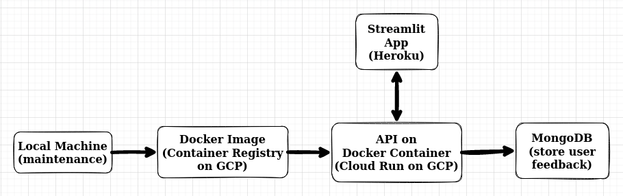
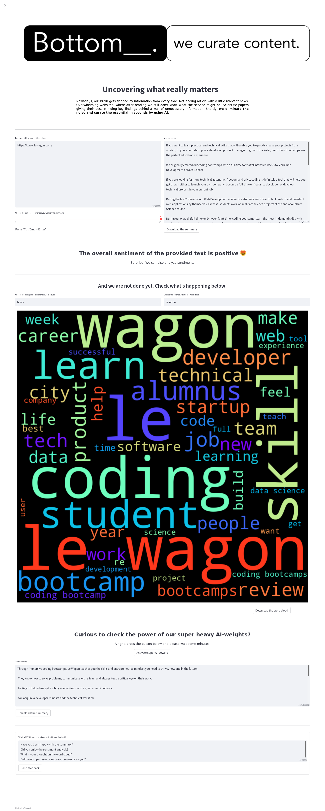

# **BUSINESS UNDERSTANDING**

## **What is the problem we will try to solve?**

The problem we are tackling is related to the overwhelming amount of information being produced by modern society. 

Information per se is valuable but it's often very challenging to spotlight the essential part of it - the bottomline, so to say. This mental-filtering process can be very time consuming and also confusing sometimes.

We claim that people rather use their mental resources efficiently than inefficiently. Furthermore, we claim that the current process, in which pieces of information are getting consumed and digested, has a significant potential for improvement. We see AI as a relevant enabler for this potential and, therefore, as a problem solver. 

# **PROBLEM UNDERSTANDING**

With our technical solution, we provide an automated service that identifies the text's most relevant sentences so as to summarize the text. Additionally, the service provides the general sentiment (positive, neutral or negative) of the text. 

Therefore, the final product will give the user a general idea about the text content as well as its most prominent sentiment.

# **PROJECT CYCLE**

## Step 01. Business Understanding:
Understand what problem we are trying to solve and what are the main concerns of this problem.

## Step 02. Data Understanding:
Understand what data we have available and plan how to use data science tools to solve the business problem.

## Step 03. Data Preparation:
Remove punctuation, misspellings and irrelevant text along with preparing data for model training.

## Step 04. Modelling:
Use machine learning and deep learning techniques to extract patterns from the data and make relevant summaries and sentiment analyses.

## Step 05. Evaluation:
Evaluate the results from modelling and check if the product so far can be deployed or need further improvements to be deployed.

## Step 06. Deploy:
Deploy the product of the respective project iteration so that users can use the product and give it feedback.

## Restart the cycle:
Analyse feedback from the last project iteration and use it as a guide for improvements in the next project cycle.

# **BUSINESS SOLUTION**

**You can check the Youtube presentation of this project at the following link:**

[Le Wagon Demoday - Data Batch #793](https://www.youtube.com/watch?v=T4gXTbcBV04&t=891s)

**You can check the whole solution architecture for this project in the following image:**

**You can check our first MVP for this project in the following image:**

# **CONCLUSIONS**

Although Natural Language Process is a specific domain within the AI field, NLP has interesting and relevant problems that could be solved using Machine Learning and Deep Learning techniques.

Doing an end-to-end data-science project is very challenging and requires many different skills. However, it gives a high opportunity for learning as well as allows you to build a much more customized solution.

Even within just two weeks, we can use data science to start solving real problems and delivering useful solutions.

# **LESSONS LEARNED**

**How to do an end-to-end NLP Data Science project.**

**How to create the whole data architecture for the app (and its API) on Google Cloud Platform.**

**Use Machine Learning and Deep Learning techniques to do text summarization.**

**Use Machine Learning and Deep Learning techniques to do sentiment analysis.**

**How to create a user-friendly app and also take into account the user experience when designing a data app.**

**Work in cycles: creating MVPs, validating solutions on user feedback and improving the product on the next project cycle.**

**Working on presentation and storytelling so even people without a data science background could understand our project and use our final product**

# **NEXT STEPS TO IMPROVE**

**Sentiment Analysis**: tune the model and train it on a larger dataset.

**Data cleaning**: test the data cleaning steps on a wider range of possible (misleading) text inputs.

**Text summary**: test more different solutions and fine-tune models.

**User input**: allow the user to input PDF and DOCX files.

**Web scraping**: make the web scraping more robust to different website HTML codes.

**UX**: improve UX for mobile usage.
